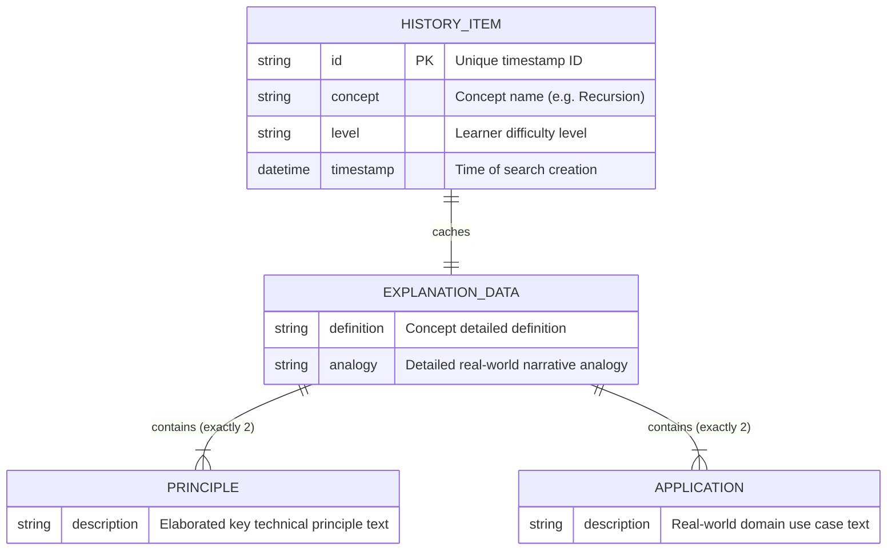
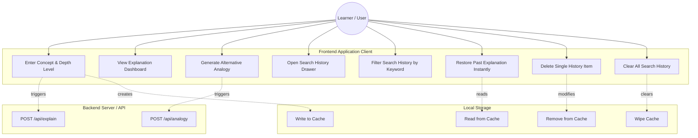
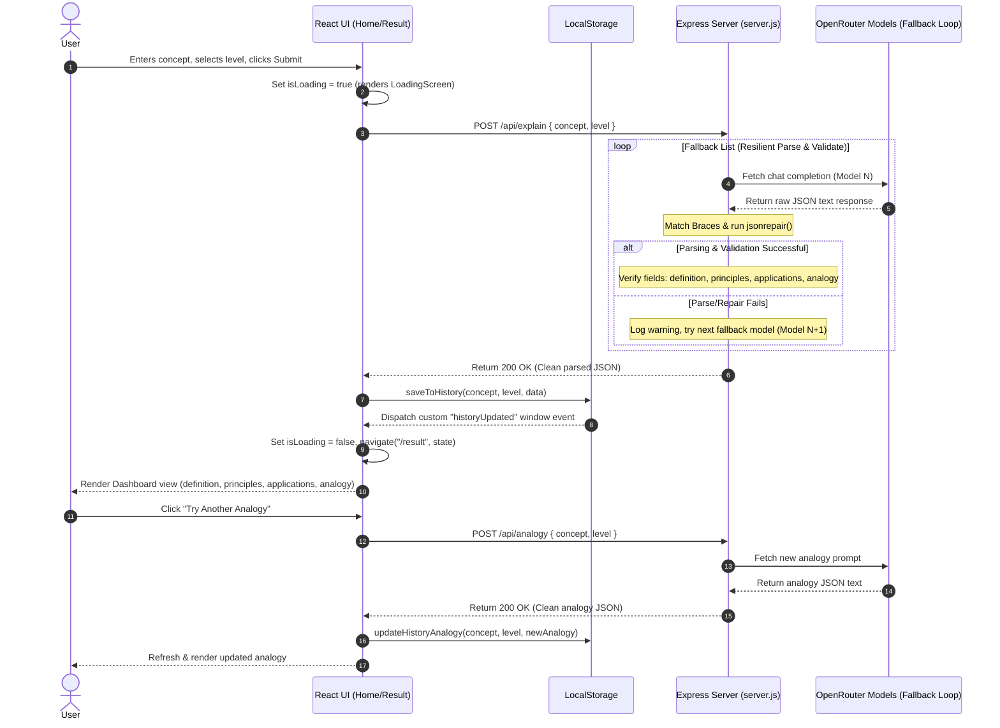
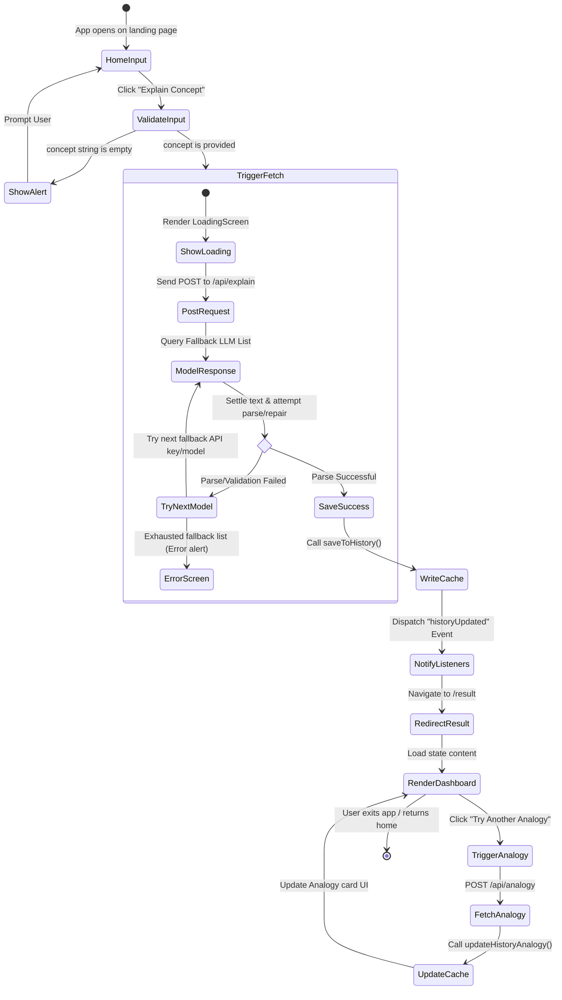

# Curator AI: UML & Database Diagrams

This document contains the structural, behavioral, and database modeling diagrams for the **Concept Explainer (Curator AI)** application using Mermaid.

---

## 1. Entity Relationship Diagram (ERD)
The ERD shows how data is structured on the client side inside `localStorage` to cache responses, prevent redundant API calls, and render the history items.



---

## 2. UML Diagrams

### 2.1. Use Case Diagram
The Use Case Diagram displays actor interaction boundaries with the frontend interface (drawer, forms, results dashboard) and the backend query limits.



---

### 2.2. Sequence Diagram
The Sequence Diagram maps the lifecycle of a search submission, detailing request routing, matching braces JSON parsing, the model fallback loop, and client-side reactive events.



---

### 2.3. Class / Component Diagram
This diagram represents the structural layout of the React client components, routing links, storage utility methods, and their associations.

```classDiagram
    class App {
        +render() Routes
    }
    class Home {
        -isLoading: boolean
        +render() JSX
    }
    class Result {
        -analogy: string
        -isGenerating: boolean
        +handleGenerateNewAnalogy() void
        +render() JSX
    }
    class Header {
        -isDrawerOpen: boolean
        +setIsDrawerOpen(state) void
        +render() JSX
    }
    class HistoryDrawer {
        -history: Array~HistoryItem~
        -searchQuery: string
        +handleItemClick(item) void
        +handleDelete(id) void
        +handleClearAll() void
        +render() JSX
    }
    class Main {
        -level: string
        -concept: string
        +handleSubmit() void
        +render() JSX
    }
    class InputForm {
        +currentLevel: string
        +setCurrentLevel() void
        +setConcept() void
        +handleSubmit() void
        +render() JSX
    }
    class HistoryUtility {
        <<utility>>
        +getHistory() Array
        +saveToHistory(concept, level, data) void
        +updateHistoryAnalogy(concept, level, newAnalogy) void
        +deleteFromHistory(id) void
        +clearHistory() void
    }

    App --> Home : routes to
    App --> Result : routes to
    Home --> Header : renders
    Home --> Main : renders
    Result --> Header : renders
    Main --> InputForm : renders
    Header --> HistoryDrawer : mounts & triggers
    Main ..> HistoryUtility : uses
    Result ..> HistoryUtility : uses
    HistoryDrawer ..> HistoryUtility : uses
```

---

### 2.4. Activity / State Diagram
The Activity Diagram details the algorithmic flow of user inputs, validations, loading transitions, fallback exceptions, and cached page restoring.


