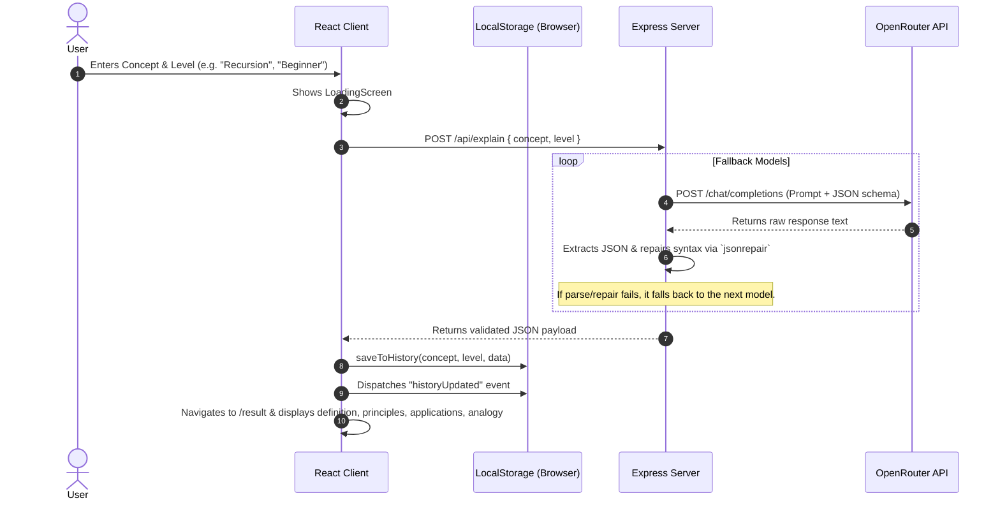

# Curator AI: Concept Explainer - Technical Architecture & Explanation

Welcome to the technical overview of the **Concept Explainer (Curator AI)**. This document explains the system architecture, code organization, communication protocols, and unique features like the robust JSON parser and the client-side history storage.

---

## 1. Overview
The **Concept Explainer** is a full-stack web application designed to break down complex academic, scientific, or technical concepts into highly intuitive insights tailored to a user's chosen depth of intelligence (**Beginner**, **Intermediate**, or **Expert**). 

The app consists of:
1. **Frontend**: A highly responsive, single-page React application styled with vanilla CSS (utilizing CSS variables, backdrop blur filters, and transitions).
2. **Backend**: An Express.js Node server that interfaces with OpenRouter to query state-of-the-art Large Language Models (LLMs) with automatic fallback and self-repairing parsing.

---

## 2. Directory Structure

Here is a high-level view of the key files in the repository:

```text
Concept-Explainer/
├── backend/                  # Node.js backend environment
│   ├── server.js             # Express server, OpenRouter fallback, robust JSON parser
│   ├── package.json          # Backend dependencies (express, node-fetch, jsonrepair)
│   └── .env                  # API keys and default configuration
├── src/                      # React frontend environment
│   ├── assets/               # Images and static media
│   ├── components/           # Reusable UI components
│   │   ├── Header/           # Header bar, logo, and History toggle button
│   │   ├── Footer/           # Footer containing copyright and links
│   │   ├── InputForm/        # Inputs for concepts and depth selector buttons
│   │   ├── LoadingScreen/    # Sleek CSS animation loading screen
│   │   ├── HistoryDrawer/    # Glassmorphic slide-out search history drawer
│   │   └── Main/             # Landing grid connecting text and InputForm
│   ├── pages/                # Page views
│   │   ├── Home/             # Explainer landing page view
│   │   └── Result/           # In-depth concepts dashboard view
│   ├── utils/
│   │   └── history.js        # LocalStorage history database & custom sync events
│   ├── App.jsx               # Application root defining React routes
│   ├── App.css               # Global stylesheets, color tokens, and scrollbars
│   ├── main.jsx              # App mounting logic
│   └── routes.js             # Router route definitions
├── eslint.config.js          # ESLint configuration
├── vite.config.js            # Vite configurations and dev proxy configuration
├── package.json              # Frontend client dependencies
└── EXPLANATION.md            # You are here!
```

---

## 3. Architecture & Data Flow

The application follows a simple, decoupled client-server architecture:



### Key Lifecycle Events:
1. **Search Submission**: The user enters a concept in the `InputForm` and selects a learning level.
2. **API Call**: A fetch request goes to `/api/explain` (proxied from Vite's dev server to port 5000 in development).
3. **AI Generation & Fallbacks**: The backend attempts to generate structured details (definition, two principles, two applications, one analogy). If a model fails to connect or returns invalid formatting, the backend tries the next model in the fallback array.
4. **Client-Side Cache & Redirect**: The client receives the response, immediately saves it in `localStorage` history, and uses React Router's stateful navigation to redirect the user to the `/result` page.

---

## 4. Core Features Explained

### A. The Client-Side Search History
Instead of requiring a complex database setup (PostgreSQL, MongoDB) or accounts/login, the app stores searches directly in the user's browser using `localStorage`.

- **Module: `src/utils/history.js`**
  - **`saveToHistory(concept, level, data)`**: Prepends a search record to history. It automatically removes any duplicate concepts searched at the same difficulty level, putting the newest one at the top. The list is capped at 25 items.
  - **`updateHistoryAnalogy(concept, level, newAnalogy)`**: Updates a specific item's cached analogy. When a user clicks **"Try Another Analogy"** on the Result page, the new analogy replaces the old one in cache so that it persists.
  - **Reactivity via Events**: When history changes, the utility calls `window.dispatchEvent(new Event("historyUpdated"))`. Any component (like the `HistoryDrawer`) listening to this event automatically refreshes its state.

- **Component: `HistoryDrawer`**
  - A slide-out panel that can be toggled from the `Header` of any page.
  - It features a search input that filters history items locally, difficulty color badges, relative time tags (e.g., "5m ago"), and a preview snippet.
  - Clicking on a history card immediately routes to `/result` using the cached response, loading the result **instantly** without making any API requests.

---

### B. Fault-Tolerant Backend JSON Parsing
LLMs are notorious for outputting invalid JSON (especially free or smaller models). Common formatting issues include raw newline breaks inside string values, unescaped double quotes within sentences, or missing/trailing commas. The backend resolves this with three layers of defense:

1. **Brace-Counting Slicing**: Rather than relying on simple substring searches, the server scans the LLM's response character-by-character to locate the exact opening `{` and its matching closing `}`. It tracks quotes and escapes so that brackets inside string values do not cause misalignments. This isolates the JSON object from conversational header/footer texts.
2. **`jsonrepair` Auto-Correction**: The isolated text is fed to `jsonrepair`. This library corrects:
   - Single-quoted keys/values to double quotes.
   - Missing commas between elements in arrays or properties.
   - Unescaped control characters (such as newlines, which standard JSON forbids inside strings).
   - Unescaped double quotes within text.
3. **Sequential Model Fallbacks**: If parsing fails even after repair, it throws an error. The fallback loop catches this, logs a warning, and immediately attempts to query the next model in the list (`FALLBACK_MODELS`), guaranteeing high reliability.

---

## 5. Styling & Responsiveness
The UI adopts a premium glassmorphic dark theme using native CSS variables inside `App.css`.

- **Aesthetic Attributes**:
  - Color scheme centered on deep navy (#0B0F19), dark gray, and neon blue accents (#22D3EE) for highlights.
  - Custom scrollbars.
  - High-intensity blur backdrops (`backdrop-filter: blur(25px)`) for cards and drawers.
- **Responsiveness**:
  - CSS Flexbox and Grid layouts rearrange elements on tablet or laptop widths.
  - Mobile responsiveness: On screens under `480px`, the header's "History" button dynamically hides its textual label, showing only the clock icon, ensuring a tight header design that never wraps.
